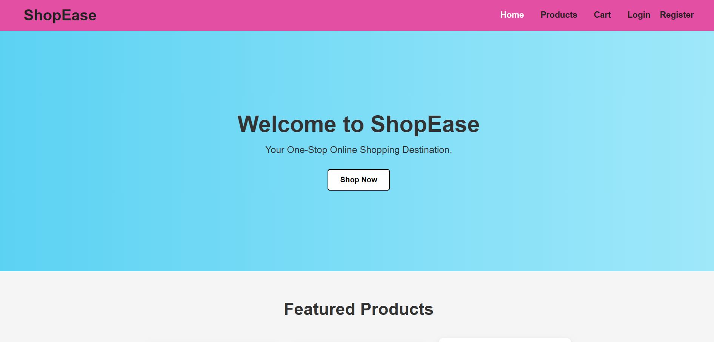
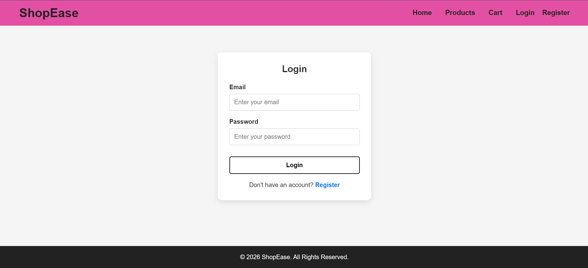
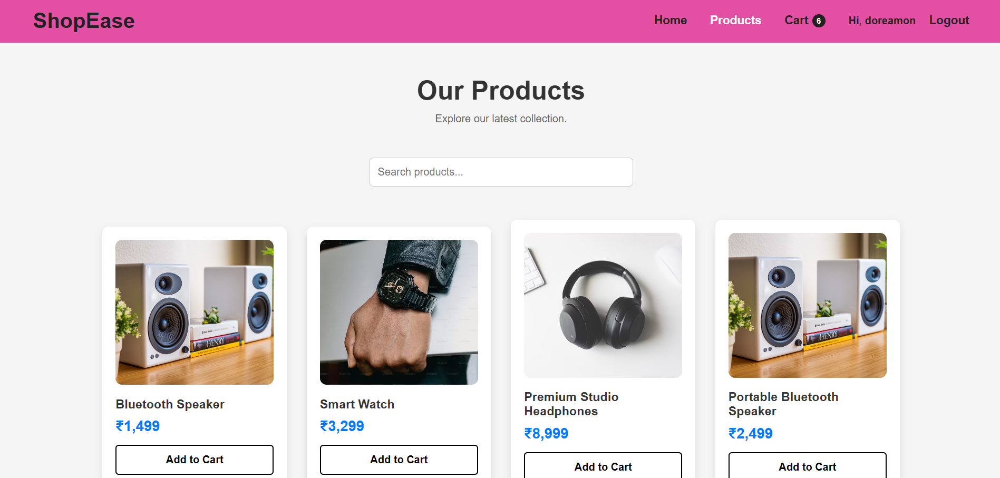
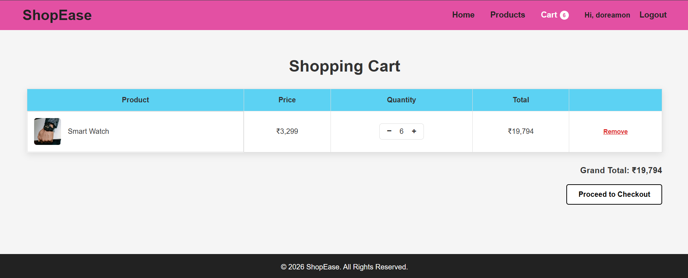
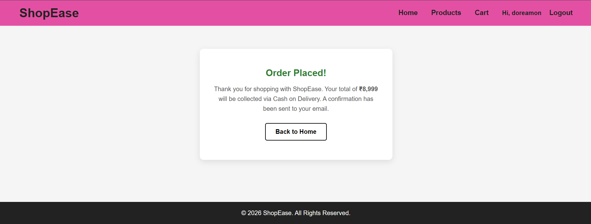

# 🛒 ShopEase - Full Stack E-Commerce Website

ShopEase is a full-stack e-commerce web application that allows users to browse products, register/login, add products to their cart, and place orders. The project includes a responsive frontend, backend APIs, authentication, and database integration.

## 🚀 Features

### 👤 User Authentication
- User registration and login
- Secure password hashing using bcrypt
- Session-based authentication with cookies

### 🛍️ Product Management
- Display products dynamically
- View product details
- Store product information in MongoDB

### 🛒 Shopping Cart
- Add products to cart
- Update product quantity
- Remove items from cart
- Calculate cart total

### 📦 Order Processing
- Place orders from cart
- Store order details
- Manage user orders

### 🗄️ Database
- MongoDB database integration
- Stores:
  - Users
  - Products
  - Cart items
  - Orders

## 🛠️ Technologies Used

### Frontend
- HTML
- CSS
- JavaScript

### Backend
- Node.js
- Express.js

### Database
- MongoDB (Atlas)

### Tools & Libraries
- bcryptjs
- mongoose
- express-session
- connect-mongo
- cors
- dotenv
- Git & GitHub

## 📂 Project Structure

```
ShopEase/
│
├── public/
│   ├── index.html
│   ├── login.html
│   ├── register.html
│   ├── cart.html
│   ├── checkout.html
│   ├── product.html
│   ├── products.html
│   ├── css/
│   │   └── style.css
│   ├── js/
│   │   ├── api.js
│   │   ├── auth.js
│   │   ├── cart.js
│   │   ├── cart-page.js
│   │   ├── checkout.js
│   │   ├── main.js
│   │   ├── product.js
│   │   └── products.js
│   └── images/
│
├── server.js
├── models/
├── routes/
├── config/
│
├── screenshots/
│   ├── home.png
│   ├── login.png
│   ├── products.png
│   ├── cart.png
│   └── orders.png
│
└── README.md
```

## ⚙️ Installation & Setup

Clone the repository:
```bash
git clone YOUR_GITHUB_LINK
```

Install dependencies:
```bash
cd ShopEase
npm install
```

Copy `_env` to `.env` and fill in your own values:
```
MONGODB_URI=your-mongodb-connection-string
PORT=5000
SESSION_SECRET=your-random-secret
CLIENT_ORIGIN=http://localhost:5000
NODE_ENV=development
```

Start the server:
```bash
npm start
```

Open `http://localhost:5000` in your browser — this serves both the frontend and the API from the same server.

## 📸 Screenshots

### Home Page


### Login Page


### Products Page


### Cart Page


### Orders Page


## 🔗 Links

**GitHub Repository:**
https://github.com/palrushideepthisree/CodeAlpha_Ecommerce_Store

**Live Demo:**
https://shopease-backend-5gfh.onrender.com

## 👨‍💻 Author

**Deepthi Sree**

GitHub: https://github.com/palrushideepthisree

LinkedIn: https://www.linkedin.com/in/deepthisreepalrushi

---
⭐ If you like this project, consider giving it a star!
